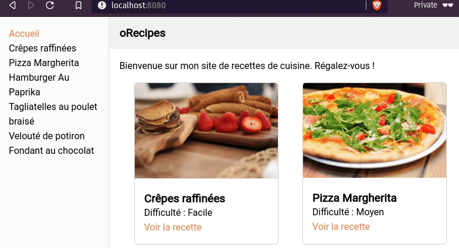

# myRecipes

Site de recettes réalisé avec React, Redux, React Router :tada:

## Objectif

## Recipe Login

Il parait que le serveur nous proposant de merveilleuses recettes nous propose également de nous connecter avec le compte d'utilisateurs ayant des recettes favorites.

## Objectifs

- Créer un `reducer` dédié à la partie `auth` de l'appli
- Créer un `middleware` pour gérer cette authentification
- Utiliser le composant `LoginForm` fourni et le brancher via un `container`
- Lire les props du composant pour mieux comprendre ses attentes ;)
- Déclencher la connexion au serveur `React-recipes-server`
- **POST** http://localhost:3001/login : en passant `email` et `password`

### Login Utilisateurs en dur pour tests

- `bouclierman@herocorp.io` / `jennifer`
- `acidman@herocorp.io` / `fructis`
- `captain.sportsextremes@herocorp.io` / `pingpong`

## Prochaine version
- créer une base de données pour pouvoir gérer les recettes, les favoris et les utilisateurs
- connecter l'API à la bdd pour effectuer de requêtes CRUD
- ajouter un blog
  
